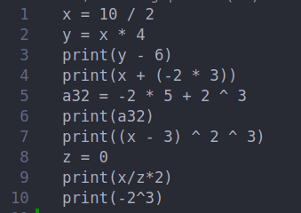
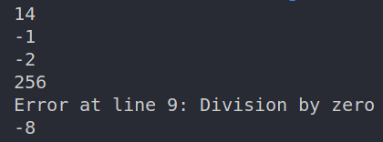

# Flex Bison Calculator
• Supports the following math functions :  
&nbsp;&nbsp;&nbsp;&nbsp;&nbsp;&nbsp;&nbsp;&nbsp;&nbsp;&nbsp;&nbsp;Add - Subtract - Divide - Multiply - Power - Assignment - Sin - Cos - Tan - Cot - Log10 - Exp  
• Can recognize both Integer and Float values.  
• Can Assign values to identifires using "=" sign.  
• Print a variable using the "print" command

# Usage
Compile using the `Makefile` 

    $ make

or manually on Linux, follow this steps:

    $ bison -d parser.y
	$ flex lex.l
	$ g++ parser.tab.c lex.yy.c -lm -o parser
    $ ./parser inputFile.txt

# Example

| Input example          | Output example         |
| ---------------------- | ---------------------- |
|  |  |
